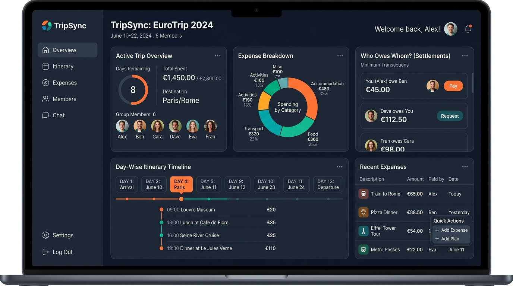
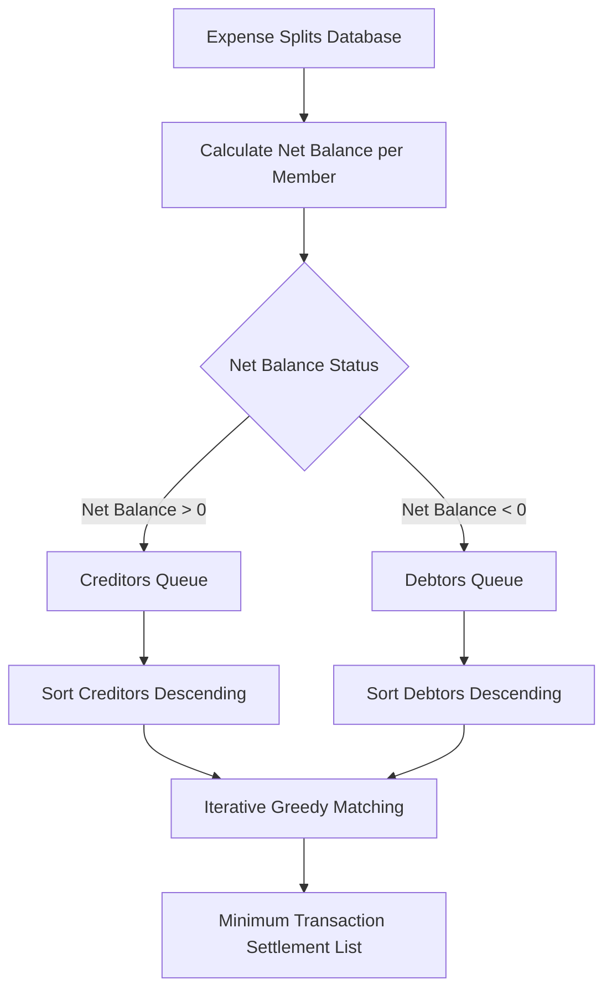

# TripSync – Smart Group Trip Planner & Expense Tracker

     

> **Plan together. Spend transparently. Travel safely. Preserve memories.**



TripSync is a full-stack group trip management platform built for college students. It replaces scattered messaging groups and spreadsheets with one centralized system for planning, expense tracking, safety, and preserving trip memories.

---

## Tech Stack

| Layer | Technologies |
|-------|-------------|
| **Backend** | Java 17, Jakarta Servlet 6, JDBC, MySQL 8 |
| **Frontend** | HTML5, CSS3, Vanilla JavaScript (SPA), Fetch API |
| **Architecture** | DAO Pattern, JDBC Utility, REST-style Servlets, Session Auth |
| **Testing & CI** | JUnit 5, Mockito, H2 Database (In-Memory) |
| **Containers & Cloud** | Docker, Docker Compose, Tomcat 10.1, Vercel (`vercel.json`) |

---

## Debt Settlement Engine Architecture

TripSync uses a greedy creditor/debtor matching algorithm to minimize the total number of transactions required to settle group debts:



---

## Features

- **Authentication** – Register, login, forgot/reset password, session management.
- **Trip Management** – Create trips, generate 8-character invite codes, join via code, role-based access.
- **Expense Tracker** – Category tagging, custom splits, receipt uploads, budget warnings.
- **Settlement Calculator** – Minimum-transaction "who owes whom" greedy algorithm.
- **Itinerary Builder** – Day-wise plans with member activity suggestions.
- **Shared Checklist** – Packing coordination (Bringing / Not Bringing status).
- **Emergency & Safety** – Trusted contacts, emergency info, live location sharing.
- **Memory Vault** – Photo gallery, captions, likes, organized by day/location.
- **Analytics** – Budget vs spent, category breakdown pie charts, member net balances.

---

## Setup & Deployment

### Option 1: Vercel Deployment (Frontend WebApp)

TripSync includes a custom `vercel.json` for single-page web app hosting on Vercel:

1. Import the repository into [Vercel Dashboard](https://vercel.com/new).
2. Set Root Directory to `SmartGroupTripPlannerAndExpenseTracker`.
3. Deploy!

### Option 2: Docker Compose (Full Stack Tomcat + MySQL)

Run the database and Tomcat application with 1 command:

```bash
docker compose up --build -d
```
Access the application at `http://localhost:8080/`.

### Option 3: Local Manual Setup

#### Prerequisites
- Java 17+
- Maven 3.8+
- MySQL 8+
- Apache Tomcat 10+ (Jakarta EE 10)

#### 1. Database Setup
```bash
mysql -u root -p < database/schema.sql
```

#### 2. Environment Configuration
`JdbcUtil` dynamically detects environment variables (`DB_URL`, `DB_HOST`, `DB_PORT`, `DB_USER`, `DB_PASS`). Alternatively, set `db.properties`:
```bash
cp src/main/resources/db.properties.example src/main/resources/db.properties
```

#### 3. Build & Run Tests
```bash
mvn clean test package
```
Deploy `target/tripsync.war` to Apache Tomcat 10 `webapps/`.

---

## Testing

Run unit tests locally with H2 in-memory DB:

```bash
mvn test
```

Test coverage includes:
- Greedy debt settlement algorithm (`SettlementServiceTest`)
- Password hashing & token generation (`UtilityTests`)
- Invite code generator (`UtilityTests`)

---

## API Endpoints

| Method | Endpoint | Description |
|--------|----------|-------------|
| `POST` | `/api/auth/register` | Create account |
| `POST` | `/api/auth/login` | Sign in |
| `DELETE` | `/api/auth/logout` | Sign out |
| `GET` | `/api/auth/me` | Current user profile |
| `GET` | `/api/trips` | List user's trips |
| `POST` | `/api/trips` | Create new trip |
| `POST` | `/api/trips/{id}/join` | Join trip via invite code |
| `GET` | `/api/expenses?tripId=` | List expenses |
| `POST` | `/api/expenses` | Add expense |
| `GET` | `/api/expenses/settlements?tripId=` | Settlement calculation |
| `GET` | `/api/itinerary?tripId=` | Get itinerary |
| `GET` | `/api/checklist?tripId=` | Get shared checklist |

---

## License

MIT License – Built as a portfolio project for full-stack Java development.
